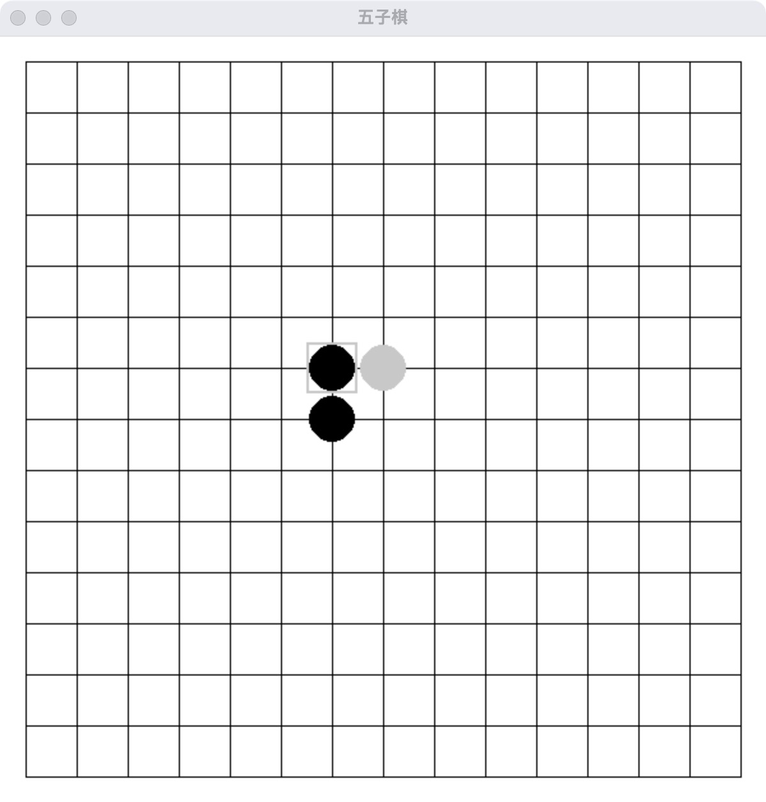

# 五子棋游戏

这是一个使用 Pygame 和一个外部模型 API 实现的五子棋游戏。玩家可以与电脑对战，电脑的下棋位置由模型 API 决定。

## 运行环境

- Python 3.8.20
- Pygame 2.6.1
- Requests 2.32.3
- Tkinter

## 安装依赖

在运行游戏之前，请确保安装了所需的依赖库。可以使用以下命令安装：

```bash
pip install pygame requests
```

## 文件说明

- `gomoku.py`：游戏的主程序文件，包含游戏逻辑和界面绘制。
- `config.py`：配置文件，包含模型 API 的相关参数。
    - `MODEL_URL`：模型 API 的 URL 地址，用于发送请求。
    - `AUTHORIZATION`：授权令牌Token，用于访问模型 API。

## 运行游戏

在终端中运行以下命令启动游戏：

```bash
python gomoku.py
```

## 游戏玩法

- 使用方向键移动光标选择位置。
- 按下回车键在选定位置下棋。
- 玩家与电脑轮流下棋，先连成五子的玩家获胜。

## 注意事项

- 请确保网络连接正常，以便模型 API 可以正常工作。
- 如果模型返回的坐标无效，程序会捕获并处理相应的错误。

## 示例代码

以下是 `gomoku.py` 文件的部分代码示例：

```python
import pygame
import sys
import requests
import re

from tkinter import messagebox, Tk
from config import MODEL_URL, AUTHORIZATION

# 初始化Pygame
pygame.init()

# 常量定义
BOARD_SIZE = 15
CELL_SIZE = 40
MARGIN = 20
WINDOW_SIZE = (BOARD_SIZE-1) * CELL_SIZE + MARGIN * 2
WHITE = (255, 255, 255)
BLACK = (0, 0, 0)
GRAY = (200, 200, 200)
RED = (255, 0, 0)

# 初始化窗口
screen = pygame.display.set_mode((WINDOW_SIZE, WINDOW_SIZE))
pygame.display.set_caption('五子棋')

# 棋盘数据
board = [[0 for _ in range(BOARD_SIZE)] for _ in range(BOARD_SIZE)]
player_turn = True  # True表示玩家回合，False表示电脑回合
selected_x, selected_y = BOARD_SIZE // 2, BOARD_SIZE // 2

def draw_board():
    screen.fill(WHITE)
    for i in range(BOARD_SIZE):
        pygame.draw.line(screen, BLACK, (MARGIN, MARGIN + i * CELL_SIZE), (WINDOW_SIZE - MARGIN, MARGIN + i * CELL_SIZE))
        pygame.draw.line(screen, BLACK, (MARGIN + i * CELL_SIZE, MARGIN), (MARGIN + i * CELL_SIZE, WINDOW_SIZE - MARGIN))
    for y in range(BOARD_SIZE):
        for x in range(BOARD_SIZE):
            if board[y][x] == 1:
                pygame.draw.circle(screen, BLACK, (MARGIN + x * CELL_SIZE, MARGIN + y * CELL_SIZE), CELL_SIZE // 2 - 2)
            elif board[y][x] == 2:
                pygame.draw.circle(screen, GRAY, (MARGIN + x * CELL_SIZE, MARGIN + y * CELL_SIZE), CELL_SIZE // 2 - 2)
    pygame.draw.rect(screen, GRAY, (MARGIN + selected_x * CELL_SIZE - CELL_SIZE // 2, MARGIN + selected_y * CELL_SIZE - CELL_SIZE // 2, CELL_SIZE, CELL_SIZE), 2)

# ...existing code...
```

## 联系方式

如果有任何问题或建议，请在Issues中联系作者。

## 游戏截图

以下是游戏的截图预览：


